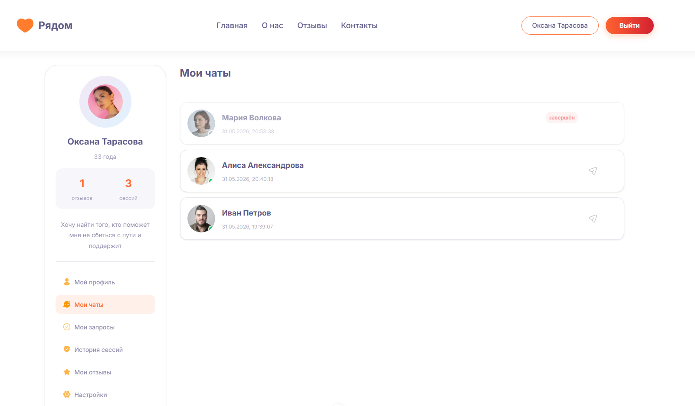
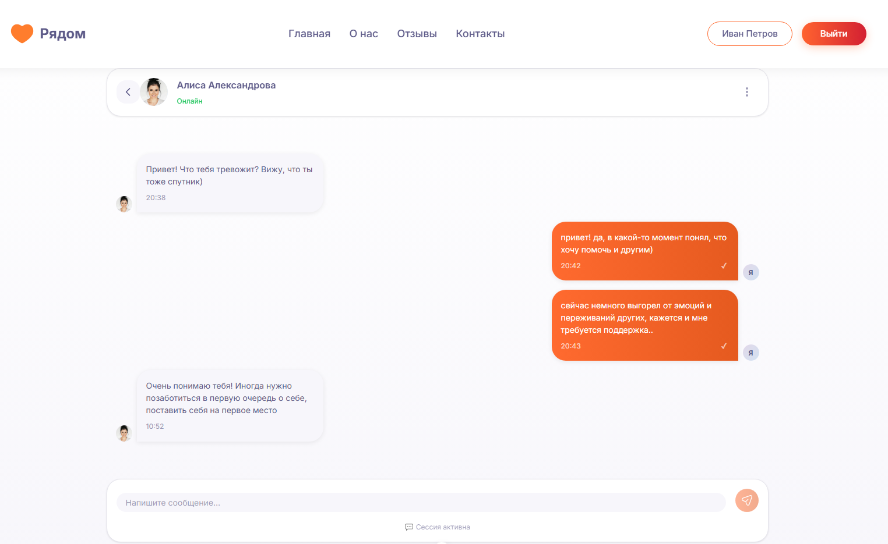
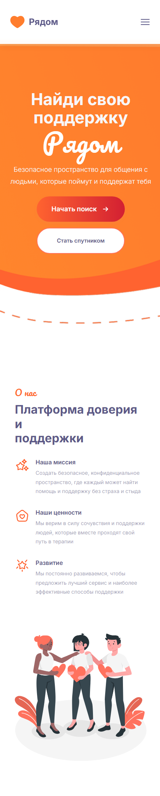

# 🧡 Рядом

> Веб-платформа психологической поддержки, созданная для безопасного и конфиденциального общения с психологами.

  

  <a href="#-о-проекте">О проекте</a> •
  <a href="#-возможности">Возможности</a> •
  <a href="#-технологии">Технологии</a> •
  <a href="#-архитектура">Архитектура</a> •
  <a href="#-лицензия">Лицензия</a>

---

## 🌱 О проекте

**«Рядом»** — веб-платформа психологической поддержки, которая объединяет пользователей и спутников в едином цифровом пространстве.

Основная идея проекта — сделать процесс получения психологической помощи более доступным, понятным и комфортным для пользователя.

Платформа позволяет пользователям взаимодействовать со спутниками через защищённые чаты, а администраторам — управлять системой и необходимыми данными.

Проект разработан с особым вниманием к:

* 🔐 конфиденциальности пользовательских данных;
* 💬 удобству общения;
* 🎨 понятному и дружелюбному интерфейсу;
* 📱 адаптивности;
* ⚡ производительности;
* 🧩 масштабируемости приложения.

---

## 🎯 Цель проекта

Создать удобный и безопасный цифровой инструмент для психологической поддержки, в котором пользователь может сосредоточиться на общении со спутником, не отвлекаясь на сложность интерфейса.

### Основные задачи

* реализовать удобную систему авторизации;
* создать приватные чаты между пользователями и спутникам;
* обеспечить безопасную работу с пользовательскими данными;
* разработать адаптивный интерфейс;
* реализовать понятную навигацию;
* организовать взаимодействие frontend и backend;

---

## ✨ Возможности

### 👤 Пользователь

* регистрация и авторизация;
* личный профиль;
* поиск / выбор спутника;
* создание и ведение диалога;
* обмен сообщениями;
* просмотр истории переписки;
* работа с платформой с различных устройств;
* блокировка спутника;
* создание жалобы на спутника;
* удаление диалога;
* создание отзыва на спутника;

### 🧑‍⚕️ Спутник

* авторизация в системе;
* профиль спутника;
* работа с обращениями пользователей;
* ведение диалогов;
* просмотр истории общения;
* блокировка спутника;
* создание жалобы на спутника;
* удаление диалога;
* создание отзыва на спутника;

### 🔐 Конфиденциальность

При разработке особое внимание уделено защите пользовательских данных и приватности общения.

В проекте предусмотрены:

* авторизация пользователей;
* разграничение доступа;
* приватные чаты;
* защита маршрутов;
* безопасное взаимодействие с API;
* разделение пользовательских данных.

> ⚠️ Проект является программным продуктом и не заменяет профессиональную медицинскую или психологическую помощь.

---

## 💬 Чаты

Одной из ключевых частей платформы является система общения.

Пользователь может открыть диалог со спутником и продолжить общение в рамках одной переписки.

Архитектура чатов позволяет в дальнейшем расширять функциональность, например добавлять:

* статус онлайн;
* уведомления о новых сообщениях;
* отправку файлов;
* реакции;
* поиск по истории переписки.

---

## 🎨 Дизайн

Интерфейс разработан с акцентом на спокойный и понятный пользовательский опыт.

Основные принципы:

* минималистичная визуальная система;
* понятная иерархия элементов;
* мягкая цветовая палитра;
* аккуратные микроанимации;
* адаптивная верстка;
* accessibility-friendly решения.

---

## 🛠 Технологии

Frontend

      

База данных

    

### Дизайн

  

---

## 🧩 Что было реализовано

### Frontend

* SPA-интерфейс;
* адаптивная верстка;
* авторизация;
* личный кабинет;
* система чатов;
* работа с API;
* обработка состояний загрузки и ошибок;
* UI-компоненты;
* анимации и микроинтеракции.

### Backend

* API;
* авторизация;
* работа с пользователями;
* управление чатами;
* работа с базой данных;
* разграничение доступа;
* обработка пользовательских данных.

### DevOps

* настройка окружения;

---

## 🚀 Результат

В результате был создан полноценный web-продукт, объединяющий:

UI/UX
  +
Frontend
  +
Backend
  +
Database
  +
Authentication
  +
Private Chat

Проект демонстрирует полный цикл разработки продукта — **от проектирования интерфейса и frontend-разработки до работы с backend, базой данных и deployment**.

---

## 📸 Скриншоты

### Главная страница

### Личный кабинет

### Чат

### Адаптивная версия

---

## 🗺 Что было сделано 

* [x] Авторизация
* [x] Личный кабинет
* [x] Система чатов
* [x] Работа с API
* [x] Адаптивный интерфейс
* [x] Realtime-сообщения
* [ ] Push-уведомления
* [ ] Расширенные настройки приватности
* [ ] Тестирование frontend
* [ ] CI/CD
* [x] Production deployment

---

## ⚠️ Предупреждение

«Рядом» является программным проектом для организации психологической поддержки и общения.

Платформа **не предназначена для экстренной медицинской помощи** и не заменяет консультацию квалифицированного спутника.

Не используйте проект для хранения реальных чувствительных данных без предварительной проверки безопасности, инфраструктуры и соответствия применимым требованиям законодательства.

---

## 📄 Лицензия

Проект распространяется под лицензией **GNU Affero General Public License v3.0**.

Подробнее см. файл [LICENSE](./LICENSE).

---

  Made with ❤️ and a lot of code

